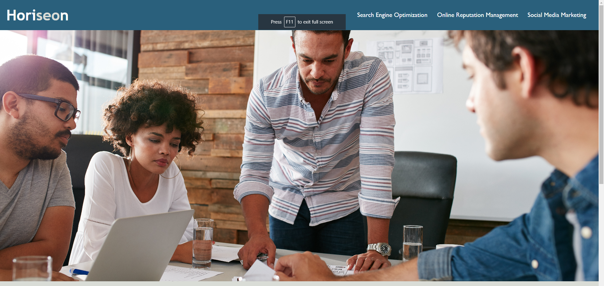
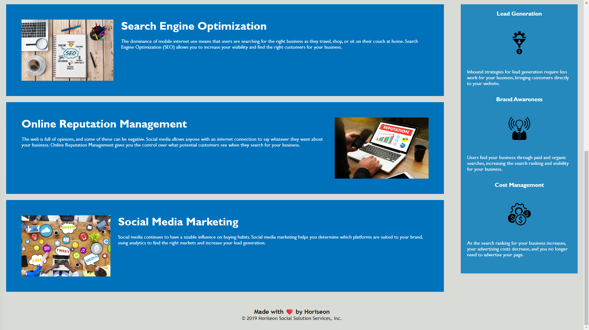

# Georgia Tech Full Stack Bootcamp Challenge 1

## Description

This is the first challenge of the GaTech Full Stack coding bootcamp. The goal is to refactor the existing code so that it follows the accessibility standards. Here is a link to the deployed wedpage: https://koi-as.github.io/bootcamp_challenge_1/

## Installation

N/A

## Usage

This webpage is used to display the knowledge I have gained on HTML, basic CSS, and the Git flow.

The first image shows what the header, nav bar, and figure elements look like on the webpage.
The second image shows what the main element and the aside elements look like on the webpage.

## Credits

N/A

## License

N/A